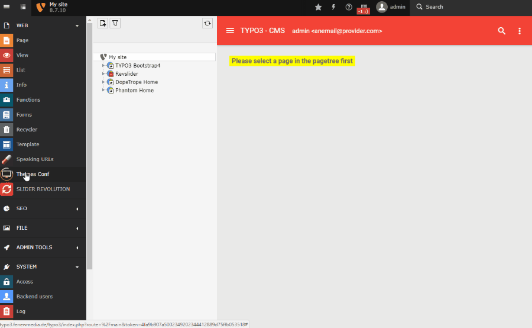
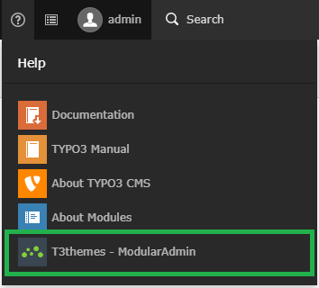

.. ==================================================
.. FOR YOUR INFORMATION
.. --------------------------------------------------
.. -*- coding: utf-8 -*- with BOM.

.. include:: ../Includes.txt

.. _users-manual:

Users manual
============

1. Install the extension from the TER.
2. Include the typoscript static templates and pageTS templates.
3. Use the ThemesConf Module to set up your default settings on your Rootpage.

Add some content and visit your frontend!

**Theme Conf Module**

	Walkthrough Theme Conf Module

Help Modules
------------

TYPO3 Themes come with an help module, with further information about that theme:

	Theme Help Modules

You will find further information about EXT:t3ms in its Documentation_.

.. _Documentation: https://docs.typo3.org/typo3cms/extensions/t3cms/